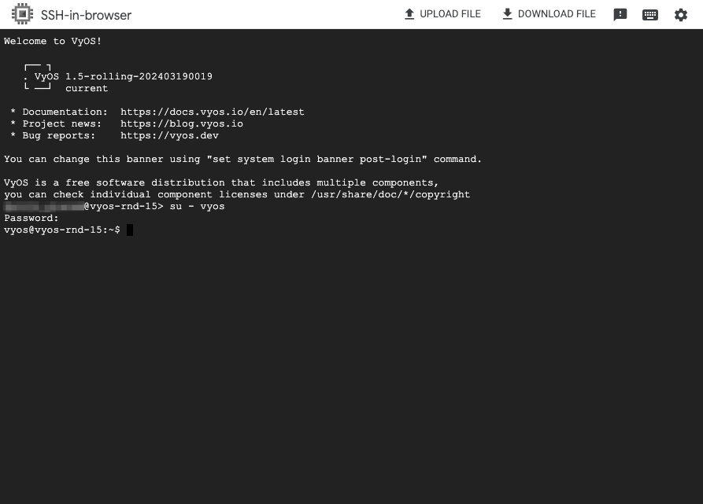

# vyos-gcp-image
Vyos (https://vyos.io/) image for Google Cloud

## About
A ready-to-go image of Vyos dedicated for Google Cloud. 

## Changes
### v2
Since v2 I am adding [GCP Guest Agent](https://cloud.google.com/compute/docs/images/install-guest-environment) - this adds support of SSH via Cloud Shell. Guest Agent is not using network daemon to configure the network - this is being done by Vyos cli.
After connecting to the instance, you have to switch to "vyos" user.



### v1
Vanilla image with no alterations to system packages

## Importing the image
- create a project in GCP and enable:
  - Logging API
  - Monitoring API
- create a Google Cloud Storage Bucket
- download image file from Releases
- upload image file to Storage Bucket
- import the image file with gcloud (replace bkt-name with your Cloud Storage Bucket name)
```sh
$ gcloud compute images create vyos --source-uri gs://bkt-name/vyos.tar.gz --guest-os-features MULTI_IP_SUBNET
```

## Using the image
The following command will create a Vyos instance using "vyos" image with following settings:
- type: f1-micro
- project: myprojectname
- zone: europe-central2-c
- eth0: vpc-hub with static IP 10.100.0.250, no public IP
- eth1: vpc-dev with static IP 10.101.0.250, no public IP
- enable IP forwarding

```sh
gcloud compute instances create vyos-dev-01 \
    --machine-type=f1-micro \
    --project=myprojectname \
    --zone=europe-central2-c \
    --image=vyos \
    --network-interface network=vpc-hub,subnet=subnet-1,private-network-ip=10.100.0.250,no-address \
    --network-interface network=vpc-dev01,subnet=subnet-dev,private-network-ip=10.101.0.250,no-address \
    --can-ip-forward
```

## Vyos configuration
The Vyos has the following configuration applied:
- username: vyos
- password: vyos
- interface eth0 set to DHCP
- configured DNS nameserver to 169.254.169.254
- NTP from metaserver
- SSH enabled

```
interfaces {
    ethernet eth0 {
        address dhcp
    }
    loopback lo {
    }
}
service {
    ntp {
        allow-client {
            address 0.0.0.0/0
            address ::/0
        }
        server metadata.google.internal {
        }
    }
    ssh {
    }
}
system {
    config-management {
        commit-revisions 100
    }
    conntrack {
        modules {
            ftp
            h323
            nfs
            pptp
            sip
            sqlnet
            tftp
        }
    }
    console {
        device ttyS0 {
            speed 115200
        }
    }
    host-name vyos
    login {
        user vyos {
            authentication {
                encrypted-password ****************
                plaintext-password ****************
            }
        }
    }
    name-server 169.254.169.254
    syslog {
        global {
            facility all {
                level info
            }
            facility local7 {
                level debug
            }
        }
    }
}
```

## Links
- https://cloud.google.com/vpc/docs/create-use-multiple-interfaces#i_am_having_connectivity_issues_when_using_a_netmask_that_is_not_32
